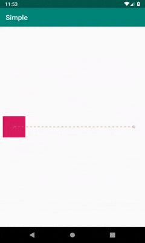
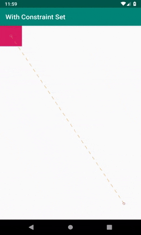
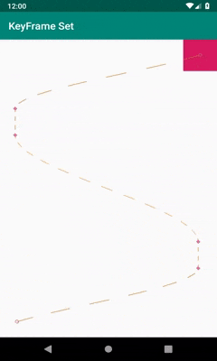

# **MotionLayout Animation**

1. #Simple MotionLayout
    
    
    
2. #MotionLayout With ConstraintSet Attribute

    
    
3. #MotionLayout With KeyFrameSet Attribute

    
    
4. #MotionLayout With Parallax Attribute

    